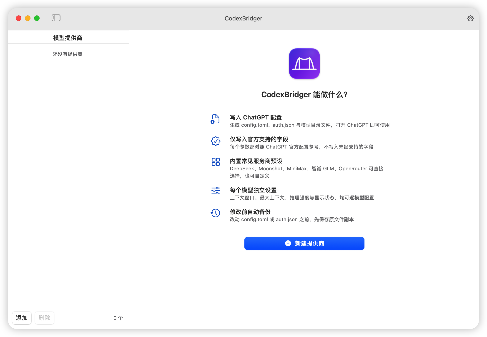
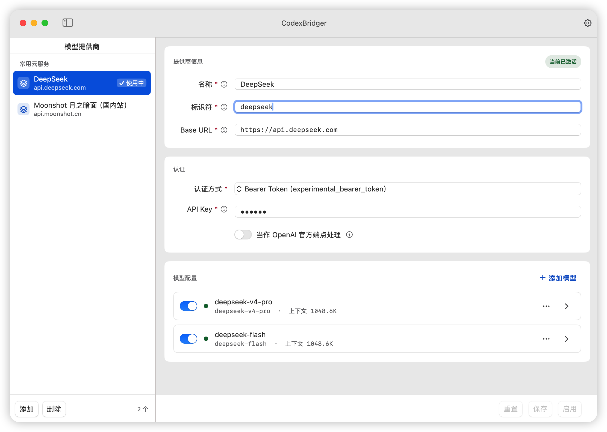

<div align="center">

# CodexBridger


**Bring any third-party model provider into ChatGPT / Codex — no more hand-editing config files.**

CodexBridger is a macOS app. Fill in a provider address, an API key and a list of models, press **Activate**, and it writes the files ChatGPT (Codex) actually reads. Open ChatGPT and your provider is ready to use.

[](LICENSE)
[](https://www.apple.com/macos/)
[](https://swift.org)

[Install](#install) ·
[Usage](#usage) ·
[Features](#features) ·
[Safety](#how-it-avoids-breaking-your-configuration)

[简体中文](./README.md) · **English**

</div>

---

<p align="center">
  <a href="ScreenShot2.png"></a>
</p>

## Why CodexBridger?

Driving ChatGPT with a third-party model (DeepSeek, Kimi, GLM, OpenRouter, …) means editing configuration files by hand. There are three of them, the field names and accepted values matter, and one wrong key can stop ChatGPT from starting — and you are expected to remember to back things up first.

CodexBridger turns that into "fill in a form, press one button": no field names to memorise, no manual backups, and it asks before it displaces whatever is in use.

It does exactly one thing: **generate and maintain ChatGPT's configuration files**. No injection, no process hijacking, and ChatGPT does not need to be running.

## The three files it writes

| File | Location | Purpose |
| --- | --- | --- |
| `config.toml` | `~/.codex/config.toml` | Tells ChatGPT which provider, which model, and where the model parameter file is |
| `auth.json` | `~/.codex/auth.json` | Stores credentials (see below) |
| `<provider>-model-catalog.json` | `~/.codex/model-catalogs/` | Model parameter file |

### How `auth.json` is handled

It is **neither** a blind overwrite **nor** an unconditional merge:

- **Keeps** everything already in the file that is unrelated, such as ChatGPT's own login token.
- **Replaces** `OPENAI_API_KEY` and writes the current provider's `<PROVIDER>_KEY`.
- **Removes** `*_KEY` / `*_API_KEY` entries left behind by other providers, so a retired service's secret does not stay on disk.
- When the bearer token is empty, no credential is written and the interface says so.

### Backup rules

Before anything is replaced, the existing `config.toml` and `auth.json` are copied into `~/.codex/backup/config-backup/`, with the provider they belonged to in the name:

- `config-<provider>-yyyy-mm-dd-hhmm-bak.toml`
- `auth-<provider>-yyyy-mm-dd-hhmm-bak.json`

A second operation within the same minute gets a `-2` or `-3` suffix instead of overwriting the previous copy.

> **The one exception**: if the configuration being replaced was **generated by CodexBridger itself** (you are switching between two providers this app manages), the backup is skipped. A configuration belonging to someone else — or one you edited by hand — is always backed up first.

## Install

### Download (recommended)

Download the `.dmg` from [Releases](https://github.com/panando/CodexBridger/releases), open it, and drag CodexBridger into Applications.

### "CodexBridger is damaged and can't be opened"

The current build uses an **ad-hoc signature**. It is not signed with an Apple Developer ID certificate and is not notarized by Apple. Because of this, macOS Gatekeeper may show either of:

> "CodexBridger" is damaged and can't be opened. You should move it to the Trash.

> "CodexBridger" cannot be opened because the developer cannot be verified.

**This usually does not mean the app is actually corrupted.** It means macOS has attached a quarantine flag to a downloaded app that has not been notarized.

#### Option 1: open from System Settings (no terminal)

1. Try opening CodexBridger once.
2. If macOS blocks it, open **System Settings → Privacy & Security**.
3. In the Security section, look for the CodexBridger warning.
4. Click **Open Anyway**.
5. Confirm opening the app.

#### Option 2: fix with Terminal

If "Open Anyway" does not appear, or macOS still says the app is damaged, first drag `CodexBridger.app` into the Applications folder. Then open Terminal and run:

```bash
sudo xattr -dr com.apple.quarantine /Applications/CodexBridger.app
```

Enter your Mac login password and press Enter. Terminal will not show password characters while typing. This is normal. Then open CodexBridger again.

If you are not sure about the app path, type this command with the trailing space:

```bash
sudo xattr -dr com.apple.quarantine 
```

Then drag `CodexBridger.app` from Finder into the Terminal window and press Enter.

> Note: Only do this for apps downloaded from sources you trust.

### Build from source

```bash
git clone https://github.com/panando/CodexBridger.git
cd CodexBridger
./scripts/build-app.sh          # produces build/CodexBridger.app
open build/CodexBridger.app     # launch it
```

Requires macOS 14 or later and the Xcode command line tools. **Zero external dependencies** — the project uses only the system Foundation and SwiftUI, and builds offline.

To hand the app to someone else, build the version that runs on both Apple silicon and Intel (**an arm64-only build does nothing at all when opened on an Intel Mac**):

```bash
./scripts/build-app.sh release universal dmg   # produces build/CodexBridger-1.0.0.dmg
```

The version has a single source: the `VERSION` file at the repository root. Change it and the build stamps it into the app's About pane. Swapping `dmg` for `zip` produces an archive instead — that needs no disk-arbitration access, so it works in CI.

## Usage

<p align="center">
  <a href="ScreenShot1.png"></a>
</p>

Before any provider is added, the window lists what the app can do and offers a **New provider** button.

1. Click **Add** at the bottom left and pick a preset (DeepSeek, Moonshot, MiniMax, Zhipu GLM, OpenRouter) or choose a custom provider.
2. Fill in the **Base URL** and **API key**.
3. Under **Models**, add the models you want. Each one carries its own context window, reasoning effort and so on.
4. Click **Activate** at the bottom right. The app writes the files and reports what it did; if it would displace the provider in use, it asks first.
5. Open ChatGPT and use it.

## Features

- **Provider management** — create, edit and delete providers; several can coexist and you can switch at any time.
- **Several models per provider** — per-model context window, maximum context, reasoning effort, and whether the model appears in the list.
- **Presets for common providers** — DeepSeek, Moonshot, MiniMax, Zhipu GLM and OpenRouter, plus fully custom providers.
- **Three credential modes** — bearer token, environment variable, or login command. They are mutually exclusive per the official documentation; only the one you choose is written.
- **Model parameter file generation** — uses the model catalogue bundled with your ChatGPT installation as the template, so the generated parameters match your version.
- **Checks before activation** — a persistent warning when `base_url` is empty or points at this machine, and a confirmation dialog before displacing a provider in use.
- **Backup browser** — the settings window lists the backup files already on disk.

## How it avoids breaking your configuration

1. **Back up before writing.** The backup completes before a single byte is modified (one exception, described under "Backup rules").
2. **Atomic writes.** Every file is written to a temporary file and then renamed over the target. If power is lost or the process is killed, ChatGPT sees either the old file or the new one, never half of either.
3. **Only its own keys are touched.** It does not re-serialise the whole `config.toml`; it replaces only the top-level fields it owns and the single `[model_providers.<id>]` table it manages. Your plugins, MCP servers, hooks and skills are left exactly as they were.
4. **Nothing unsupported is written.** Every field comes from the official configuration reference.
5. **It asks before displacing what is in use.** Before activating, it reads which provider ChatGPT is actually using. If the change would move away from a *different* provider, it asks first, stating "currently using X, switching to Y".
6. **A broken file is never reported as "no configuration".** If CodexBridger's own `config.json` is corrupt, the interface reports the error and states that the original file was left untouched, rather than showing "0 providers".

## Known limitations

- Requires macOS 14 or later. The interface is SwiftUI, and there is no Windows version.
- **No Apple Developer signature and no notarisation.** Other people will be blocked the first time they open a downloaded copy. This is not corruption; see ["CodexBridger is damaged and can't be opened"](#codexbridger-is-damaged-and-cant-be-opened).

## License

Released under the [MIT License](LICENSE).

Copyright (c) 2026 panando
